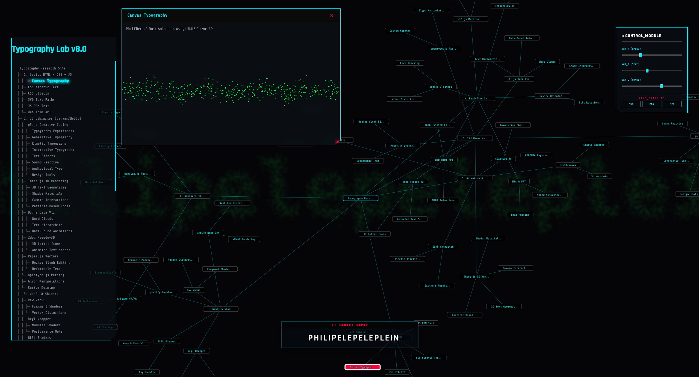

# Typography Research Lab

> 🚧 **WORK IN PROGRESS**
> This project is currently in **active development**. The taxonomy, visual experiments, and graph interactions are being continuously refined.
> *Last Update: Nov 2025*

An interactive web archive and experimental playground exploring the intersection of typography, code, and generative design. The project visualizes the taxonomy of web typography technologies through a synchronized dual-interface system.

🔗 **[View Live Project](https://yunglordsimens.github.io/audiovisual/)**

---

### /PREVIEW

---

### /SYSTEM OVERVIEW

This project serves as a comprehensive **living archive**, cataloging various methods of manipulating text on the web—from basic HTML/CSS to advanced WebGL shaders and AI interactions.

The interface features a unique **dual-navigation system**:
1.  **The Sidebar:** A hierarchical ASCII-style directory tree representing the structured data.
2.  **The Graph:** A dynamic **D3.js force-directed graph** that visualizes the connections between technologies.

**Current Features:**
* **Interconnected Navigation:** Interacting with the text sidebar updates the physics-based graph in real-time.
* **Context-Aware Environment:** The background visual ecosystem (built with **p5.js**) shifts its behavior (Wave, Pulse, Pixel Storm) based on the currently selected topic.
* **Embedded Showcases:** Specific nodes trigger isolated iframes demonstrating raw techniques.

### /TECH ARCHITECTURE

The application is built without heavy frameworks, relying on powerful libraries for specific visual tasks:

| Component | Technology | Role |
| :--- | :--- | :--- |
| **Data Visualization** | **D3.js (v7)** | Physics-based force graph, node linking, and drag interactions. |
| **Generative Background** | **p5.js** | Reactive background modes (`wave`, `spiral`, `pixel-storm`) and particle systems. |
| **Visual Effects** | **Canvas API / CSS3** | Raw pixel manipulation and kinetic typography demos. |
| **Logic** | **Vanilla JS (ES6+)** | State management, DOM synchronization, and event handling. |

### /FUTURE ROADMAP

Planned updates for the next phase of development:

- [ ] **Mobile Optimization:** Adapting the D3 graph physics for touch screens.
- [ ] **More Showcases:** Adding interactive examples for the "WebGL" and "Audio Reactive" sections.
- [ ] **Search Functionality:** Implementing a search bar to filter nodes in real-time.
- [ ] **Expanded Content:** Completing descriptions for all leaf nodes in the hierarchy.

### /CREDITS

**Maria Chernobay** — Concept, Architecture, and Development.

Developed as part of the digital research curriculum at **UMPRUM**.

---

© 2025–2026 Maria Chernobay.
